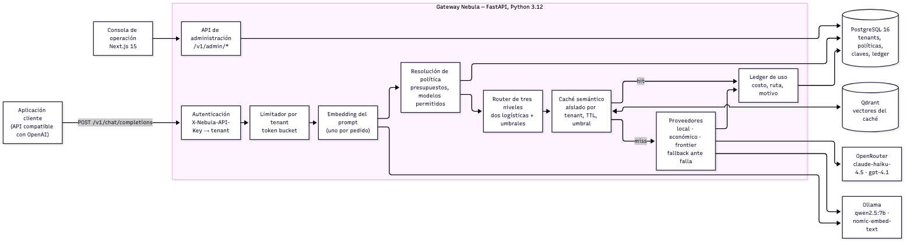
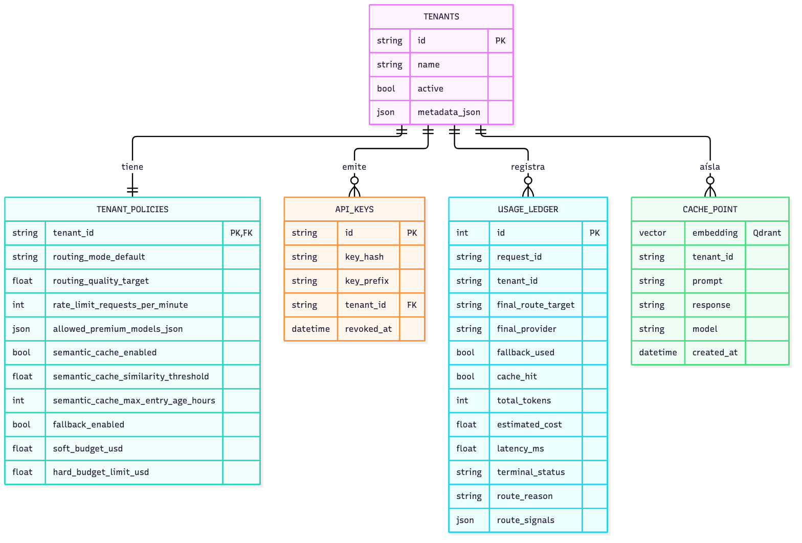
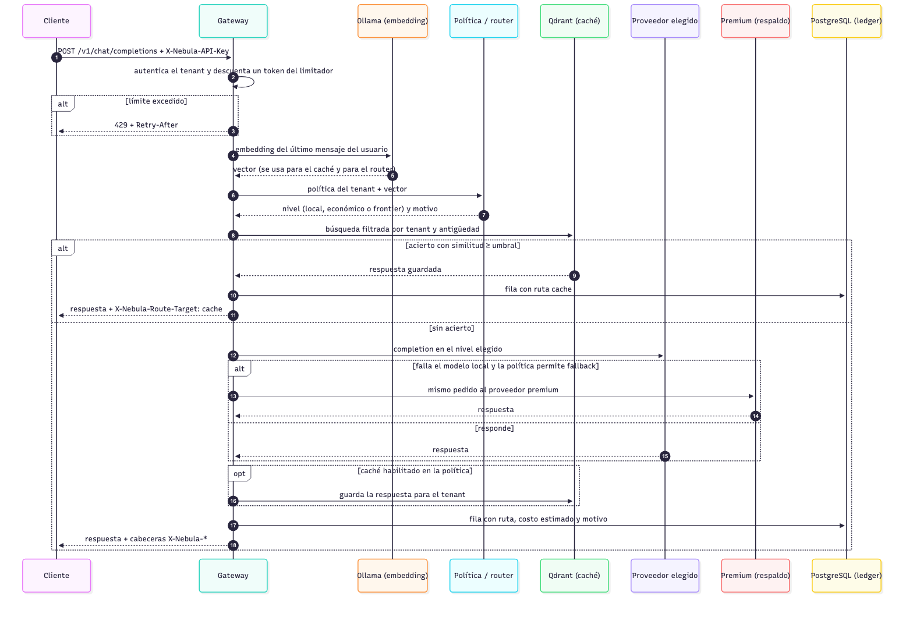
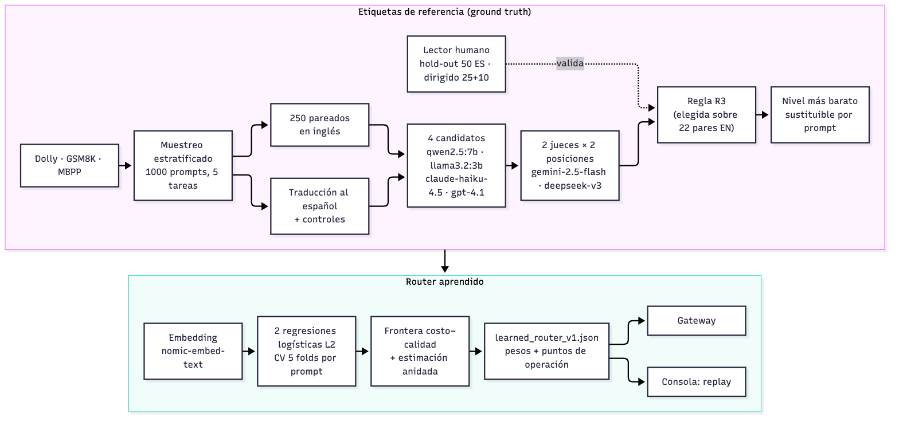

# 10. Diseño de la solución

## 10.1 Formulación del modelo

El problema que dejó el capítulo 9 tiene tres partes: hace falta una regla de ruteo que se apoye
en evidencia, hace falta la evidencia misma, y hace falta que el operador pueda decidir cuánto
ahorro quiere a cambio de cuánta calidad. La solución se formuló como un gateway que, para cada
pedido, estima la probabilidad de que un nivel barato responda tan bien como el modelo de
referencia, y elige el nivel más barato cuya probabilidad supera un umbral. Los umbrales no se
fijan a mano: salen de una frontera costo–calidad medida sobre un corpus propio, y el operador
elige un punto de esa frontera indicando la calidad que necesita.

La Figura 10.1 muestra la arquitectura resultante. Los componentes nuevos respecto de la versión
inicial son el router de tres niveles, el aislamiento del caché por tenant, el limitador de
pedidos y la página de evaluación de la consola; el resto (autenticación, políticas, proveedores,
ledger) se mantuvo y se adaptó.



**Figura 10.1.** Arquitectura del gateway: componentes del proceso FastAPI, almacenes y
proveedores externos.

El pedido entra autenticado por su clave, pasa por el limitador del tenant y se calcula un único
embedding del último mensaje del usuario. Con ese vector se resuelve la política y el router
propone un nivel; después se consulta el caché, que si encuentra una respuesta equivalente evita la
llamada al modelo. Si no hay acierto, el pedido va al proveedor del nivel elegido, y la respuesta
se guarda en el caché y en el ledger.

### Tipos de solución considerados

Antes de elegir el diseño se consideraron tres familias de solución, que son las que ordena la
literatura revisada en el capítulo 8 [@moslem2026]:

- **Reglas fijas.** Es lo que ya existía. No requiere datos, pero la sección 9.1 muestra que no
  tiene relación con la calidad.
- **Cascada con verificación.** El pedido va primero al modelo barato y se escala si la respuesta
  no pasa un control, como en FrugalGPT [@frugalgpt] o AutoMix [@automix]. Juzga la respuesta
  real, pero cada escalamiento paga dos generaciones y un juicio. Con el modelo local tardando
  una mediana de 21.3 s por respuesta en esta máquina (Tabla 11.9), una cascada que empieza por el
  local sumaría esos segundos a todos los pedidos que terminan en el premium.
- **Router aprendido que decide antes de generar.** Un clasificador estima la dificultad del
  pedido y lo manda directamente al nivel elegido, como Hybrid LLM [@hybridllm] y RouteLLM
  [@routellm]. Cuesta una inferencia barata por pedido y necesita datos etiquetados.

Se eligió la tercera, porque es la única que respeta el presupuesto de latencia del límite
tecnológico (una sola generación por pedido) y porque produce, como subproducto del entrenamiento,
la frontera costo–calidad que el operador necesita para decidir. La cascada queda como línea
futura (sección 12.4).

### Decisiones de diseño

La Tabla 10.1 resume las cinco decisiones más importantes. Cada una se justifica con una referencia
al marco teórico, una alternativa descartada y su relación con los límites del trabajo.

**Tabla 10.1.** Decisiones de diseño.

| Decisión | Alternativas | Elegida | Justificación |
|---|---|---|---|
| D1. Cómo decidir la ruta | reglas fijas; cascada; router aprendido | router aprendido de tres niveles | Una sola generación por pedido, compatible con la latencia del modelo local; la frontera sale del entrenamiento [@hybridllm], [@routellm]. |
| D2. Qué clasificador usar | kNN sobre embeddings; red neuronal; regresión logística | dos regresiones logísticas L2 | Con el mismo corpus, la logística es más barata que kNN en todos los niveles de calidad (USD 1.70 contra 1.76 cada mil prompts a calidad 0.95; Tabla 11.6) y se sirve con un producto escalar, sin dependencias en el gateway. Con 1250 ejemplos una red no tiene datos para superarla. |
| D3. Cómo medir la calidad | similitud coseno; un juez LLM; ensamble de jueces validado | dos jueces de otra familia, en las dos posiciones, con reglas pre-registradas y validación humana | El coseno no separa calidad (AUC 0.25, sección 9.1); un juez solo tiene sesgos de posición y de autopreferencia [@wang2024fair], [@panickssery]. |
| D4. Cómo aislar el caché | caché global; caché por usuario; caché por tenant | por tenant, con umbral y antigüedad de la política | Un caché global puede servirle a un cliente la respuesta generada para otro. Aislar por usuario, como MeanCache [@meancache], reduce mucho los aciertos. El tenant es la unidad de política del gateway. |
| D5. Cómo acceder a los modelos premium | API directa de cada proveedor; LiteLLM como dependencia; OpenRouter | OpenRouter, con fallback local→premium | Una sola integración para los dos niveles premium, que además informa el costo real de cada llamada, que es el que usa la evaluación. El gateway sigue siendo self-hosted: lo externo son los modelos, no el plano de control. |

Dos decisiones menores se desprenden de estas. La primera es que el router usa **el mismo
embedding que el caché** (`nomic-embed-text` sin prefijo de tarea). Durante el entrenamiento se
probó el prefijo `classification`, que dio un AUC apenas mayor (0.679 contra 0.663 para el nivel
local); la regla fijada de antemano exigía una mejora de al menos 0.02 para cambiar, y no la
alcanzó. Mantener un solo vector evita un segundo llamado a Ollama por pedido (RNF-03). La segunda
es el **modelo local**: con qwen2.5:7b, 742 de los 1000 prompts en español tienen una respuesta
local sustituible, contra 615 con llama3.2:3b (Tabla 11.4); el modelo de 7B entra en los 16 GB
de la máquina, así que se eligió ese, y el de 3B queda como análisis de sensibilidad.

### El router de tres niveles

El router tiene dos clasificadores. El primero estima $p_\text{local}$, la probabilidad de que la
respuesta del modelo local pueda reemplazar a la del frontier; el segundo estima $p_\text{eco}$,
lo mismo para el modelo económico. Los dos son regresiones logísticas con regularización L2 sobre
el embedding del prompt. La regla de decisión es una cascada sobre dos umbrales:

$$
\text{nivel} =
\begin{cases}
\text{local} & \text{si } p_\text{local} \ge \tau_\text{local} \\
\text{económico} & \text{si no, y } p_\text{eco} \ge \tau_\text{eco} \\
\text{frontier} & \text{en otro caso}
\end{cases}
$$

Cada par $(\tau_\text{local}, \tau_\text{eco})$ es un punto de operación, con un costo y una
calidad medidos fuera de fold. El artefacto del router guarda los puntos que forman la frontera de
Pareto. En tiempo de ejecución, el tenant declara un objetivo de calidad (`routing_quality_target`)
y el router toma el punto más barato cuya calidad medida lo alcanza. Un objetivo de 1.0 manda todo
al frontier, porque una calidad medida de 1.0 significa que ningún pedido barato falló en el
entrenamiento, no que ninguno pueda fallar.

El fragmento siguiente, tomado de `src/nebula/services/learned_router.py`, es toda la lógica de
decisión en el gateway:

```python
def tier_for(p_local: float, p_economy: float, point: OperatingPoint) -> Tier:
    if p_local >= point.tau_local:
        return "local"
    if p_economy >= point.tau_economy:
        return "economy"
    return "frontier"
```

Si el embedding no está disponible (Ollama caído) o no coincide con la dimensión del artefacto, el
gateway no falla: decide con la heurística de dos reglas y lo marca en las señales de la ruta.

## 10.2 Modelo de datos

La Figura 10.2 muestra el modelo de datos. PostgreSQL guarda la gobernanza (tenants, políticas,
claves y ledger) y Qdrant guarda los vectores del caché.



**Figura 10.2.** Modelo de datos: tablas de PostgreSQL y punto del caché en Qdrant.

- **tenants** y **tenant_policies** tienen una relación uno a uno. La política concentra todo lo
  que el operador puede ajustar: el modo de ruteo, el objetivo de calidad del router, el límite de
  pedidos por minuto, los modelos premium permitidos, el caché (habilitado, umbral de similitud,
  antigüedad máxima), el fallback, los presupuestos blando y duro, y la captura de evidencia.
- **api_keys** guarda solo el hash de la clave y su prefijo; la clave en claro se muestra una
  única vez, al crearla.
- **usage_ledger** tiene una fila por pedido, con la ruta final, el proveedor, si hubo caché o
  fallback, los tokens, el costo estimado, la latencia, el estado terminal, el motivo de la
  decisión y las señales del router (probabilidades, umbrales, nivel).
- Cada **punto del caché** en Qdrant lleva el embedding del prompt y, en el payload, el tenant, el
  prompt, la respuesta, el modelo que la generó y la fecha. La búsqueda filtra por tenant y por
  fecha antes de comparar vectores, así que un tenant nunca puede recibir la respuesta de otro.

El router tiene su propio artefacto, versionado en el repositorio
(`src/nebula/data/learned_router_v1.json`): el modelo de embedding y el prefijo con que se
entrenó, los pesos y el sesgo de las dos logísticas, la regularización elegida y la lista de
puntos de operación con su costo y su calidad. Junto a él está el archivo de replay que usa la
consola (`router_replay_v1.json`), con las probabilidades fuera de fold de los 1250 prompts. Los
dos se regeneran con `python -m scripts.router.train`.

> CAPTURA (fase 7): edición de la política del tenant en la consola, con el objetivo de calidad y
> el límite de pedidos.

## 10.3 Modelo de procesos

Hay dos procesos que conviene distinguir: el que atiende un pedido en línea y el que, fuera de
línea, produce las etiquetas y entrena el router.

**Atención de un pedido.** La Figura 10.3 muestra la secuencia de un pedido de chat. El orden
tiene dos consecuencias de diseño. La primera es que el embedding se calcula una sola vez y sirve
para el router y para el caché. La segunda es que el router decide antes de consultar el caché:
si hay acierto, la decisión no se usa, pero queda en las señales del ledger, lo que permite
auditar qué nivel habría atendido ese pedido.



**Figura 10.3.** Recorrido de un pedido de chat por el gateway.

El fallback solo actúa en un sentido: si el modelo local falla y la política lo permite, el
pedido se reenvía al proveedor premium, y la respuesta lo informa en `X-Nebula-Fallback-Used`. Si
el que falla es el proveedor premium, el error se devuelve al cliente, porque no hay un nivel más
capaz al que escalar. Si Qdrant no responde, el gateway sigue sin caché; si Ollama no responde, el
caché y el router aprendido quedan sin vector y la ruta se decide con la regla de respaldo.

**Etiquetado y entrenamiento.** La Figura 10.4 muestra el proceso fuera de línea. A partir de tres
conjuntos de datos públicos se arma un corpus bilingüe, cuatro modelos candidatos responden cada
prompt, dos jueces comparan cada respuesta con la del frontier en las dos posiciones, y una regla
fijada de antemano convierte las cuatro notas en un veredicto de sustituible o no. El nivel de
cada prompt es el más barato cuya respuesta resulta sustituible. Con esas etiquetas se entrenan
los dos clasificadores, se traza la frontera y se escribe el artefacto que carga el gateway.



**Figura 10.4.** Pipeline de etiquetado y entrenamiento del router.

**Operación.** El operador trabaja desde la página Evaluación de la consola. Ahí ve la frontera,
mueve un control entre 0.75 y 1.00 y el simulador reproduce, sin llamar a ningún modelo, cómo se
repartirían los 1250 prompts del corpus entre los tres niveles y cuánto costarían. Cuando elige un
punto, lo aplica al tenant, y desde el pedido siguiente el router usa ese objetivo de calidad. En
el Playground, cada respuesta muestra por qué se eligió su nivel: las dos probabilidades, los
umbrales del punto vigente y el nivel resultante.

> CAPTURA (fase 7): página Evaluación con el control de calidad y la frontera.

> CAPTURA (fase 7): Playground con el panel "Por qué este nivel".
