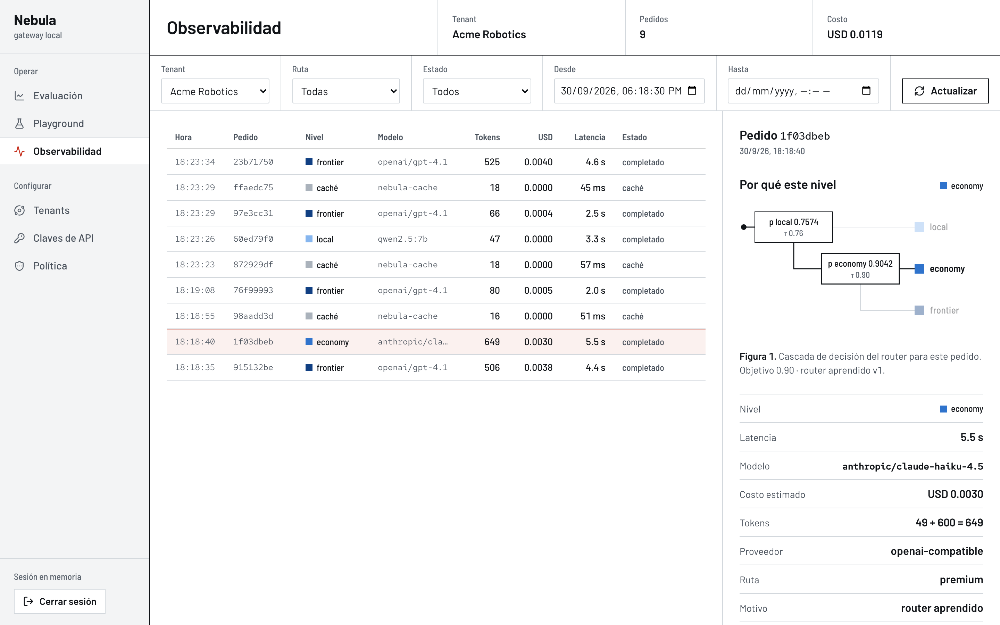
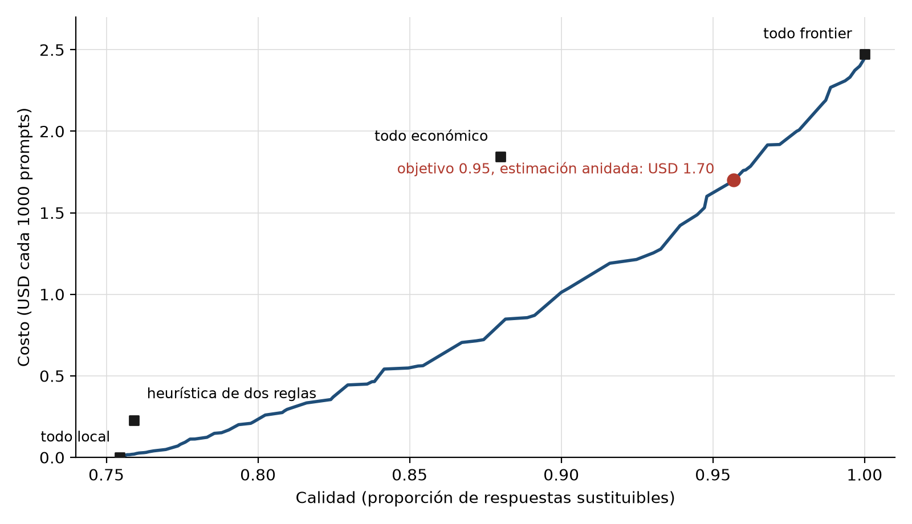

# 11. Implantación y desarrollo del prototipo

El prototipo se construyó de forma iterativa, en seis fases, cada una en una rama propia que se
integró con un pull request después de pasar la suite de pruebas y una revisión independiente. El
historial del repositorio es la evidencia de ese proceso: cada fase tiene su especificación y su
plan en `docs/superpowers/`, y cada decisión que se apartó del plan quedó registrada. Este
capítulo describe las herramientas usadas y, sobre todo, cómo se probó el sistema y qué resultados
dio.

## 11.1 Herramientas

La Tabla 11.1 lista el stack del prototipo. Para cada tecnología se indica qué función cumple y
contra qué alternativa se la eligió.

**Tabla 11.1.** Stack tecnológico.

| Tecnología | Función | Alternativa descartada | Justificación |
|---|---|---|---|
| Python 3.12 + FastAPI [45] | Gateway y API de administración | Go; Node.js | El trabajo combina servicio web y aprendizaje automático; Python tiene los dos ecosistemas y FastAPI es asíncrono, que es lo que pide un proxy que pasa la mayor parte del tiempo esperando a un proveedor. El rendimiento alcanza para el límite de escala declarado. |
| PostgreSQL 16 | Tenants, políticas, claves y ledger | SQLite; MongoDB | Datos relacionales con claves foráneas y consultas agregadas sobre el ledger. SQLite queda solo para los tests. |
| Qdrant [32] | Vectores del caché semántico | pgvector; FAISS en memoria | Filtros por payload (tenant, fecha) combinados con la búsqueda por similitud en una sola consulta, y persistencia propia. |
| Ollama [27] + qwen2.5:7b [28] | Modelo local | llama.cpp directo; vLLM | Sirve modelos cuantizados en Apple Silicon con una API simple. vLLM está pensado para GPU de servidor [26], fuera del límite tecnológico. |
| nomic-embed-text [30] | Embedding del caché y del router | embeddings de un proveedor pago | Corre local en Ollama, sin costo por pedido y sin sacar los prompts de la máquina. |
| OpenRouter [44] | Acceso a claude-haiku-4.5 y gpt-4.1 | API directa de cada proveedor | Una sola integración para los dos niveles premium, con el costo real de cada llamada en la respuesta. |
| Next.js 15 + React 19 | Consola de operación | panel server-side con plantillas | Interfaz interactiva para el simulador de la frontera, que corre en el navegador sin llamar a modelos. |
| pytest, Vitest, Playwright | Pruebas unitarias, de integración y de extremo a extremo | pruebas manuales | Cada fase se integró solo con pytest y Vitest en verde. |
| NumPy + regresión logística propia | Entrenamiento del router | scikit-learn | Dos logísticas con L2 y validación cruzada agrupada se escriben en pocas líneas; el gateway las sirve sin NumPy, con un producto escalar. |
| Docker Compose | Despliegue self-hosted | Kubernetes | Un solo comando levanta gateway, consola, PostgreSQL y Qdrant, que es lo que necesita un equipo que se aloja a sí mismo. |

La Tabla 11.2 muestra cómo se reparte el código. El backend tiene unas 7 500 líneas de Python, la
consola unas 6 700 de TypeScript, los scripts de datos y entrenamiento unas 5 800 y las pruebas
unas 12 200.

**Tabla 11.2.** Módulos del backend (`src/nebula/`).

| Módulo | Líneas | Responsabilidad |
|---|---|---|
| `services/` | 4 435 | Atención de pedidos, política, router heurístico y aprendido, caché, limitador, simulación de políticas, recomendaciones, retención |
| `benchmarking/` | 1 106 | Suite de escenarios reproducible y sus reportes |
| `api/` | 645 | Rutas HTTP (chat, embeddings, administración, salud) y dependencias de autenticación |
| `models/` | 497 | Esquemas Pydantic compatibles con OpenAI y de gobernanza |
| `providers/` | 308 | Clientes de Ollama y de proveedores compatibles con OpenAI |
| `core/` | 244 | Configuración y contenedor de dependencias |
| `db/` | 136 | Modelos ORM y sesión |
| `observability/` | 121 | Métricas Prometheus |

Las métricas con que se valida el trabajo son cuatro, y todas se calculan sobre el mismo corpus:

- **Calidad:** proporción de prompts cuya respuesta, en el nivel que eligió la política, es
  sustituible por la del modelo frontier según las etiquetas de los jueces. El nivel frontier
  cuenta como sustituible por definición, porque es la referencia.
- **Costo:** gasto medio por prompt, expresado en dólares cada mil prompts, con el costo que
  informó OpenRouter al generar cada respuesta. El modelo local cuesta cero en el margen.
- **Ahorro:** $1 - \text{costo}_\text{política} / \text{costo}_\text{todo frontier}$, con un
  intervalo de confianza del 95 % por bootstrap de percentiles sobre prompts (1000 remuestras,
  agrupando cada prompt con su traducción) [35].
- **Acuerdo del instrumento:** κ de Cohen binario entre la regla de los jueces y el lector humano
  [42], con intervalo por bootstrap, y proporción de rechazos confirmados en el conjunto
  dirigido con intervalo de Wilson [36]. Para los clasificadores se reporta además el AUC
  fuera de fold [34].

La consola muestra esas magnitudes pedido por pedido. La vista de observabilidad (Figura 11.1)
lista cada fila del ledger con su nivel, su modelo, su costo y su latencia, y para el pedido
seleccionado dibuja la decisión del router y el registro completo.

**Figura 11.1.** Vista de observabilidad: ledger del tenant de demo con el nivel, el modelo, el
costo y la latencia de cada pedido, y el detalle del pedido seleccionado (objetivo de calidad
0.90).

## 11.2 Pruebas y resultados

### 11.2.1 Plan de pruebas

La hipótesis tiene dos criterios y los dos se miden en la misma evaluación: el ahorro de gasto
premium contra la línea base de enviar todo al modelo frontier, que tiene que ser de al menos un
30 %, y la tasa de respuestas aceptables, que no puede quedar más de 5 puntos por debajo de la de
esa línea base. El plan de pruebas se organizó para producir esas dos cifras con un instrumento
validado, y para comprobar, por separado, que el gateway se comporta como dice su diseño.

**Entorno.** Todo corre en una MacBook con Apple M4 y 16 GB de memoria, macOS 26.5, Python
3.12.13, Ollama 0.34.4 (qwen2.5:7b, llama3.2:3b y nomic-embed-text), Qdrant y PostgreSQL en
Docker. Los modelos premium se consultaron por OpenRouter, a temperatura 0, entre el 27 y el 30 de
septiembre de 2026 (las respuestas y los juicios, el 27 y el 28; la latencia, el 30). Las semillas, los hashes de los prompts y de los datasets de origen y las
versiones de los modelos quedaron en `benchmarks/ground-truth/v1/provenance.json`.

**Tipos de prueba.**

1. *Unitarias y de integración* (pytest para el backend, Vitest para la consola): cada componente
   del gateway y de la consola, con proveedores y caché simulados.
2. *De extremo a extremo* (Playwright): la consola contra el gateway real.
3. *Validación del instrumento de calidad:* acuerdo de los jueces con un lector humano, con
   reglas y umbral pre-registrados antes de correr los jueces sobre el corpus.
4. *Evaluación del router:* validación cruzada de 5 folds agrupada por prompt, y una estimación
   anidada en la que ningún prompt evaluado influye en los pesos ni en los umbrales que lo rutean.
5. *Rendimiento:* latencia de cada modelo sobre 30 prompts en español, en secuencia.

**Criterios de éxito.** Ahorro ≥ 30 % y calidad ≥ 0.95 frente a la línea base, con el router en
el objetivo 0.95. Para el instrumento, el pre-registro fijó un κ de al menos 0.4 en el hold-out en
español como condición para declarar el ground truth "no limitado por los jueces".

### 11.2.2 Casos de prueba

La Tabla 11.3 resume los casos de prueba. La tabla completa, con la entrada y el test o reporte
que respalda cada caso, está en el Anexo A. La suite automática tiene 453 pruebas del backend (pytest) y 131 de la consola (Vitest), todas en verde al cierre de esta etapa, más siete archivos de pruebas de extremo a extremo con Playwright.

**Tabla 11.3.** Casos de prueba (P = pasó, F = falló).

| ID | Descripción | Resultado esperado | Resultado obtenido | Estado |
|---|---|---|---|---|
| CP-01 | Ahorro del router en el objetivo 0.95 | ≥ 30 % contra todo frontier | 31 % (IC 95 % 28–35 %) | P |
| CP-02 | Calidad del router en el objetivo 0.95 | ≥ 0.95 | 0.957 | P |
| CP-03 | Router contra mezcla aleatoria de niveles a igual calidad | menor costo | 17 % menos (IC 95 % 12–21 %) | P |
| CP-04 | Heurística de dos reglas contra todo local | calidad mayor que todo local | calidad 0.759 contra 0.754 | F |
| CP-05 | Acuerdo jueces–humano, hold-out en español | κ ≥ 0.4 | κ 0.31 | F |
| CP-06 | Rechazos de los jueces confirmados por el humano | mayoría | 20 de 25 (80 %) | P |
| CP-07 | Similitud coseno como métrica de calidad | AUC > 0.5 | AUC 0.25 | F |
| CP-08 | Caché aislado por tenant y antigüedad | nunca sirve la respuesta de otro tenant ni una vencida | filtrado en la consulta | P |
| CP-09 | Fallback local → premium | el pedido se completa en el premium | completado, `X-Nebula-Fallback-Used: true` | P |
| CP-10 | Caída de Qdrant | el gateway sigue respondiendo sin caché | responde, salud degradada | P |
| CP-11 | Caída de Ollama con el router activo | decide con la regla de respaldo | heurística, señal registrada | P |
| CP-12 | Límite de pedidos por minuto | 429 + `Retry-After`, sin llamar al proveedor | 429, fila `rate_limited` en el ledger | P |
| CP-13 | Objetivo de calidad por tenant | el nivel sigue al vector con el objetivo fijo; un objetivo de 1.0 manda al frontier | se cumple; el reparto por objetivo es el de la Tabla 11.8 | P |
| CP-14 | Cabeceras `X-Nebula-*` en cada ruta | presentes y coherentes con el ledger | presentes | P |
| CP-15 | Replay de la consola | coincide con el artefacto del router | coincide | P |
| CP-16 | Pruebas de extremo a extremo de la consola | todas pasan | 2 fallan (observabilidad, playground) | F |
| CP-17 | Cifras de la tesis al día con los reportes | ningún bloque desactualizado | al día | P |

Los casos en F merecen una lectura. CP-04 y CP-07 son resultados negativos esperables y útiles:
muestran que la regla anterior y la métrica anterior no servían, que es el motivo del trabajo.
CP-05 es el que hay que discutir con más cuidado, y se retoma en 11.2.4 y 11.2.5. CP-16 son dos
pruebas de la consola con selectores ambiguos, que ya fallaban antes de esta etapa y se corrigen
junto con el rediseño de la interfaz; no afectan al gateway ni a la evaluación.

### 11.2.3 Resultados

**Corpus.** El corpus es la base de toda la evaluación:

<!-- GEN:corpus-fase2 -->
El corpus combina tres conjuntos públicos: dolly (CC BY-SA 3.0); gsm8k (MIT); mbpp (CC BY 4.0). Se muestrearon 1000 prompts estratificados por tarea (code 200, factual_qa 200, multistep_reasoning 200, open_writing 200, summarisation 200) con semilla fija, y un subconjunto pareado de 250 en inglés. La traducción al español la hizo `mistralai/mistral-medium-3.1`, de una familia ajena a candidatos y jueces. Un control mecánico rechazó 10 traducciones que alteraban bloques de código, o números en razonamiento y código (donde los números son la tarea), y se reemplazaron desde la reserva del mismo estrato; en las tareas de Dolly, 31 traducciones reescribieron números por estilo (p. ej. «siglo XV») y quedaron marcadas para la revisión humana. Una revisión humana de 40 traducciones encontró 0 infieles (0%).
<!-- /GEN:corpus-fase2 -->

Cuatro modelos respondieron cada prompt: qwen2.5:7b y llama3.2:3b en local, claude-haiku-4.5 como
nivel económico y gpt-4.1 como frontier y referencia. Construir el corpus y juzgarlo costó USD
9.84 en APIs.

**Jueces y validación.** Cada respuesta barata se comparó con la del frontier:

<!-- GEN:judges-fase2 -->
Cada par candidato–referencia recibe cuatro notas (dos jueces, dos posiciones). La regla se eligió sobre 22 pares en inglés etiquetados por un lector humano; esos pares se eligieron en el piloto por desacuerdo entre dos jueces previos y quedaron 20 sustituibles y 2 no, así que el kappa de selección descansa en muy pocos negativos. Kappa binario por regla: R1 -0.015, R2 0.327, R3 0.645; se eligió R3. Como análisis de sensibilidad pre-registrado, los niveles se reportan bajo las tres reglas. Sobre el hold-out en español (50 pares sorteados antes de correr los jueces) la regla elegida obtuvo kappa 0.31 (IC 95 % -0.07–0.64). El acuerdo bruto fue 82%; el lector juzgó sustituibles 45 de 50, y en los desacuerdos el ensamble fue más estricto que el lector 7 veces y más laxo 2. Al quedar por debajo de 0.4, el ground truth se declara limitado por los jueces. Análisis post hoc, no pre-registrado: el evaluador marcó como de baja confianza sus notas sobre pares de código, porque la terminal de etiquetado reenvuelve los bloques de código; sin esos pares (40) el kappa es 0.44 (IC 95 % 0.00–0.78). Como el hold-out tuvo pocos negativos, un segundo conjunto dirigido —no aleatorio, sin pares de código— mezcló a ciegas pares que el ensamble rechazó con pares que aceptó: el lector coincidió con el rechazo en 20 de 25 (80%, IC 95 % 61%–91%), y juzgó sustituibles 9 de 10 aceptados. Tasa de cambio de veredicto al invertir posiciones: deepseek-chat-v3-0324 8%, gemini-2.5-flash 12%.
<!-- /GEN:judges-fase2 -->

Con las etiquetas de la regla elegida, cada prompt queda asignado al nivel más barato cuya
respuesta es sustituible. La Tabla 11.4 muestra cómo se reparten, bajo cada regla y por tarea.

**Tabla 11.4.** Distribución de niveles por regla de etiquetado e idioma, y por tarea en español
con la regla elegida (cantidad de prompts).

<!-- GEN:tier-distribution -->
| Regla | Idioma | Local | Económico | Frontier |
|---|---|---|---|---|
| R1 unanimidad | inglés | 163 | 38 | 49 |
| R1 unanimidad | español | 551 | 215 | 234 |
| R2 mayoría | inglés | 182 | 27 | 41 |
| R2 mayoría | español | 661 | 196 | 143 |
| R3 media ordinal (elegida) | inglés | 201 | 24 | 25 |
| R3 media ordinal (elegida) | español | 742 | 174 | 84 |
| R3 con llama3.2:3b como local | inglés | 177 | 49 | 24 |
| R3 con llama3.2:3b como local | español | 615 | 281 | 104 |

| Tarea (español, R3) | Local | Económico | Frontier |
|---|---|---|---|
| código | 145 | 37 | 18 |
| preguntas factuales | 139 | 44 | 17 |
| razonamiento | 171 | 24 | 5 |
| escritura abierta | 107 | 55 | 38 |
| resumen | 180 | 14 | 6 |
<!-- /GEN:tier-distribution -->

**Router.** Sobre esas etiquetas se entrenó y evaluó el router:

<!-- GEN:router-fase3 -->
El router aprendido son dos regresiones logísticas sobre el embedding del prompt (prefijo `none`), evaluadas con validación cruzada de 5 folds agrupada por prompt sobre 1250 prompts; AUC fuera de fold: local 0.66, economy 0.65, una señal modesta. En la estimación anidada —umbrales y pesos elegidos sin el fold que se rutea— con objetivo de calidad 0.95 el router logra calidad 0.957 a USD 1.70 cada mil prompts, 31% menos que enviar todo al modelo frontier (USD 2.47; IC 95 % 28%–35%) y 17% menos que la mejor mezcla aleatoria de niveles a igual calidad (IC 95 % 12%–21%). Con objetivo 0.90 logra 0.903 a USD 1.06. El objetivo se cumple sobre el conjunto; por idioma la calidad fue 0.961 en español y 0.940 en inglés. La heurística de dos reglas no mejora a enviar todo al modelo local: calidad 0.759 contra 0.754, a USD 0.23 cada mil prompts. El oráculo, que conoce la etiqueta, costaría USD 0.51: queda margen. El costo local se cuenta en cero; su precio es el tiempo: en esta máquina la mediana por respuesta fue openai/gpt-4.1 2.5 s, anthropic/claude-haiku-4.5 3.9 s, llama3.2:3b 9.8 s, qwen2.5:7b 21.3 s (30 prompts, secuencial). Las reglas de etiquetado R1 y R2 se reportan como sensibilidad.
<!-- /GEN:router-fase3 -->

La Tabla 11.5 compara el router con las políticas fijas, y la Tabla 11.6 lo compara con otro
clasificador y con la mezcla aleatoria de niveles en tres niveles de calidad.

**Tabla 11.5.** Costo y calidad de las políticas fijas y del router (1250 prompts).

<!-- GEN:router-fixed-policies -->
| Política | Costo (USD cada 1000 prompts) | Calidad |
|---|---|---|
| todo local (qwen2.5:7b) | 0.00 | 0.754 |
| todo económico (claude-haiku-4.5) | 1.84 | 0.880 |
| todo frontier (gpt-4.1) | 2.47 | 1.000 |
| oráculo | 0.51 | 1.000 |
| heurística de dos reglas → frontier | 0.23 | 0.759 |
| heurística de dos reglas → económico | 0.12 | 0.756 |
| router aprendido, objetivo 0.95 (estimación anidada) | 1.70 | 0.957 |
<!-- /GEN:router-fixed-policies -->

**Tabla 11.6.** Costo del nivel de calidad pedido, en USD cada mil prompts, según la política de
ruteo (frontera fuera de fold).

<!-- GEN:router-cost-at-quality -->
| Política | calidad ≥ 0.85 | calidad ≥ 0.90 | calidad ≥ 0.95 |
|---|---|---|---|
| regresión logística (elegida) | 0.56 | 1.01 | 1.70 |
| kNN (k = 20) | 0.64 | 1.06 | 1.76 |
| mezcla aleatoria de niveles | 0.96 | 1.47 | 1.97 |
<!-- /GEN:router-cost-at-quality -->

**Tabla 11.7.** Sensibilidad a la regla de etiquetado: costo del router en cada nivel de calidad,
en USD cada mil prompts.

<!-- GEN:router-sensitivity -->
| Regla de etiquetado | calidad ≥ 0.85 | calidad ≥ 0.90 | calidad ≥ 0.95 | todo frontier |
|---|---|---|---|---|
| R1 unanimidad | 1.31 | 1.59 | 1.97 | 2.47 |
| R2 mayoría | 1.04 | 1.32 | 1.83 | 2.47 |
| R3 media ordinal (elegida) | 0.56 | 1.01 | 1.70 | 2.47 |
<!-- /GEN:router-sensitivity -->

La Figura 11.2 muestra la frontera completa y la Tabla 11.8 lista los puntos de operación que el
operador puede elegir desde la consola.

**Figura 11.2.** Frontera costo–calidad del router aprendido, con las políticas fijas y el punto
del objetivo 0.95 en la estimación anidada.

**Tabla 11.8.** Puntos de la frontera: umbrales, costo y reparto de pedidos por nivel.

<!-- GEN:router-frontier-points -->
| Calidad mínima | τ local | τ económico | Costo (USD cada 1000) | Local | Económico | Frontier |
|---|---|---|---|---|---|---|
| 0.80 | 0.64 | 0.84 | 0.26 | 89 % | 4 % | 7 % |
| 0.85 | 0.70 | 0.90 | 0.56 | 76 % | 1 % | 23 % |
| 0.90 | 0.76 | 0.90 | 1.01 | 56 % | 4 % | 40 % |
| 0.95 | 0.82 | 0.92 | 1.70 | 27 % | 6 % | 67 % |
| 0.98 | 0.86 | 0.94 | 2.17 | 10 % | 1 % | 89 % |
<!-- /GEN:router-frontier-points -->

**Tabla 11.9.** Latencia por respuesta en esta máquina (30 prompts en español, en secuencia).

<!-- GEN:router-latency -->
| Modelo | Mediana (s) | p90 (s) | Respuestas |
|---|---|---|---|
| openai/gpt-4.1 | 2.5 | 5.2 | 30 |
| anthropic/claude-haiku-4.5 | 3.9 | 6.4 | 30 |
| llama3.2:3b | 9.8 | 17.4 | 30 |
| qwen2.5:7b | 21.3 | 36.2 | 30 |
<!-- /GEN:router-latency -->

### 11.2.4 Análisis de resultados

Con el objetivo de calidad en 0.95, el router cumple los dos criterios de la hipótesis. Gasta
USD 1.70 cada mil prompts contra USD 2.47 de mandar todo a gpt-4.1, un 31 % menos, y entrega una
calidad de 0.957, 4.3 puntos por debajo de la referencia, dentro de los 5 puntos que admite la
hipótesis. Estas cifras son las de la estimación anidada: los umbrales y los pesos que rutearon
cada prompt se eligieron sin mirarlo, así que no se trata de un ajuste a posteriori.

Que el router ahorre contra el frontier no alcanza para decir que aprendió algo, porque cualquier
mezcla de niveles baratos también ahorra. Por eso la comparación que más importa es contra la
mezcla aleatoria que llega a la misma calidad: en la estimación anidada, esa mezcla costaría USD
2.04 cada mil prompts para la calidad de 0.957, y el router es un 17 % más barato (IC 12–21 %). Las
señales son modestas (AUC 0.66 y 0.65), pero alcanzan para ordenar los prompts mejor que el azar,
y la diferencia se sostiene en los tres niveles de calidad de la Tabla 11.6 y frente a un
clasificador distinto como kNN.

La heurística de dos reglas, en cambio, no aprendió nada útil. Su calidad (0.759) es prácticamente
la de mandar todo al modelo local (0.754): casi todos los prompts del corpus son cortos y no tienen
las palabras clave, así que casi todo va al local. El 40 % de ahorro que la suite medía en agosto
era real, pero se pagaba con calidad, y la suite no lo veía.

El ahorro sale sobre todo del modelo local, que atiende el 27 % de los pedidos en el objetivo 0.95,
y muy poco del nivel económico (6 %). Esto tiene una explicación en los datos: claude-haiku-4.5
cuesta el 75 % de lo que cuesta gpt-4.1 sobre este corpus (USD 1.84 contra 2.47) y solo es
sustituible en el 88 % de los prompts, así que mandarle un pedido ahorra poco y arriesga bastante.
La distribución cambia por idioma: en inglés el local atiende el 49 % de los pedidos, y en español
el 21 %. Parte de la diferencia está en las etiquetas (la respuesta local es sustituible en el 74 %
de los prompts en español y en el 80 % en inglés), y parte en que el router confía menos en el
local para el español, que es la carga principal del
trabajo.

Queda por discutir el instrumento. El κ del hold-out en español (0.31) no llegó al 0.4
pre-registrado, y el caso CP-05 se reporta como fallado. Pero el tipo de desacuerdo importa más
que su cantidad. En la muestra aleatoria, de los nueve desacuerdos, en siete los jueces rechazaron
respuestas que el lector aceptaba y solo en dos aceptaron respuestas que el lector rechazaba. Los
jueces son más exigentes que el lector, y sus rechazos tienen fundamento: en un conjunto dirigido
sin código, el lector coincidió con 20 de cada 25. Como el lector
humano es la referencia de lo que le sirve a quien pregunta, un juez más estricto clasifica como
insuficientes algunas respuestas baratas que en realidad servían, lo que baja la calidad medida
del router y lo empuja a mandar más pedidos al frontier. El 31 % de ahorro está medido con esa
vara: el ahorro tiende a estar subestimado.

Hay una segunda razón por la que la cifra es conservadora. La hipótesis habla del gateway completo, que
combina el router con el caché semántico, pero el corpus no tiene consultas repetidas: cada prompt
aparece una vez por idioma, así que el 31 % sale solo del router. En tráfico real, donde una parte
de las consultas se repite o se parece a una anterior [19], [14], cada acierto del caché
evita además la llamada al modelo. Las corridas de agosto, con la heurística, servían 3 de 14
pedidos desde el caché. El ahorro del caché depende tanto del tráfico que no se puede estimar con
este corpus, y por eso no se suma; lo que se puede afirmar es que se agrega al del router, no que lo
reemplaza.

Con el objetivo en 0.90 el router ahorra bastante más (57 %, USD 1.06), pero la calidad cae a
0.903, casi 10 puntos por debajo de la referencia, y no cumple el segundo criterio. Ese punto
existe en la consola para el operador que lo prefiera, pero no es el que responde la hipótesis.

### 11.2.5 Amenazas a la validez

Las cifras anteriores dependen de decisiones y de límites que conviene hacer explícitos. Para cada
amenaza se indica qué es, qué efecto puede tener sobre los resultados y cómo se mitigó.

1. **Acuerdo de los jueces con el lector en español.** El κ de la regla elegida sobre el hold-out
   fue 0.31 (IC 95 % −0.07 a 0.64), por debajo del umbral de 0.4 que el pre-registro fijó para
   declarar el ground truth como "limitado por los jueces"; ese es el nombre que el reporte le da.
   El acuerdo bruto fue del 82 %: el κ es bajo en buena medida porque el hold-out tuvo pocos
   negativos (el lector aceptó 45 de 50), y con tan pocos negativos cada desacuerdo pesa mucho. En
   los desacuerdos, los jueces fueron más estrictos 7 veces y más laxos 2. *Efecto:* la calidad
   medida de los niveles baratos tiende a quedar por debajo de la real, y con ella el ahorro.
   *Mitigación:* la dirección del sesgo se estima sobre la muestra aleatoria (7 contra 2), y un
   conjunto dirigido de rechazos comprobó que esos rechazos tienen fundamento.
2. **Un único evaluador humano, que es el autor.** Todas las notas humanas son de la misma
   persona. *Efecto:* no se puede medir el acuerdo entre humanos, y el juicio del evaluador podría
   estar influido por conocer el sistema. *Mitigación:* el etiquetado fue ciego a la ruta y al
   modelo que generó cada respuesta, el orden de las respuestas se sorteó, y el evaluador pasó por
   una ronda de calibración con ítems diseñados para detectar criterios superficiales. Hubo dos pasadas
   anteriores que se descartaron: una previa a esa ronda y otra que la superó pero que el propio
   evaluador retiró porque juzgaba por el tema y no por la sustituibilidad; las dos quedaron
   documentadas en el repositorio.
3. **Selección de la regla sobre 22 pares elegidos por desacuerdo.** Los pares en inglés con que
   se eligió la regla R3 no son una muestra aleatoria: el piloto los seleccionó porque dos jueces
   previos los leían distinto, y quedaron 20 sustituibles y 2 no. *Efecto:* el κ de selección
   (0.65) descansa en dos negativos y puede haber favorecido a la regla más permisiva.
   *Mitigación:* el pre-registro obligó a reportar los niveles bajo las tres reglas; con R1 y R2
   el router sigue ahorrando contra el frontier en todos los niveles de calidad (Tabla 11.7), pero
   menos.
4. **Conjunto dirigido de 25 + 10 pares.** Es una muestra elegida a propósito entre los rechazos
   y los aceptados del ensamble, sin pares de código. *Efecto:* mide la precisión de los rechazos,
   no el acuerdo general, y no dice nada del código. Sus tasas de error (5 de 25 rechazos y 1 de 10
   aceptaciones que el lector no compartió) no se pueden extrapolar al corpus: si se lo hiciera, el
   balance entre rechazos y aceptaciones erróneas quedaría cerca de cero. *Mitigación:* se lo
   presenta como evidencia de que los rechazos tienen fundamento, con su intervalo de Wilson
   (61–91 %); la dirección del sesgo se apoya en la muestra aleatoria.
5. **Notas humanas de código de baja confianza.** La terminal de etiquetado reenvolvía los bloques
   de código, y el evaluador marcó esas notas como poco confiables. *Efecto:* el κ incluye 10 pares
   con notas dudosas; sin ellos sube a 0.44, un análisis hecho después de ver los datos.
   *Mitigación:* se reporta como análisis post hoc; re-etiquetar el código con un visor propio
   queda como línea futura.
6. **Selección de la regularización y de los umbrales.** La regularización λ se eligió por
   pérdida logarítmica fuera de fold sobre todo el corpus, y la grilla se extendió hacia abajo
   después de que la primera corrida eligiera su borde. Los umbrales del artefacto que usa el
   gateway salen de la frontera fuera de fold sobre todo el corpus. *Efecto:* la estimación
   anidada deja fuera del fold evaluado los umbrales y los pesos, pero no el λ, así que puede ser
   levemente optimista. *Mitigación:* el λ es un solo parámetro por clasificador, elegido de una
   grilla de seis valores por pérdida logarítmica y no por el costo ni la calidad del ruteo, que son
   las cifras que se reportan.
7. **Intervalo del ahorro.** El ahorro puntual es 31 % y su intervalo de confianza va de 28 % a
   35 %. *Efecto:* con esta muestra no se puede excluir, al 95 %, un ahorro algo menor que el 30 %.
   El intervalo, además, remuestrea prompts con la ruta fija y no incorpora la variabilidad de
   reentrenar el router. *Mitigación:* el sesgo del instrumento (amenaza 1) va en la dirección
   contraria, hacia subestimar el ahorro.
8. **La referencia vale 1.0 por construcción.** La calidad se mide como sustituibilidad respecto
   de la respuesta de gpt-4.1, que por definición es sustituible por sí misma. *Efecto:* la línea
   base tiene calidad 1.0 aunque sus respuestas no sean perfectas; la cifra de 0.957 es relativa
   al frontier, no una tasa absoluta de respuestas correctas. *Mitigación:* es la comparación que
   plantea la hipótesis (cuánto se pierde frente a usar siempre el premium).
9. **Latencia del modelo local.** El costo del modelo local se cuenta en cero, pero en esta
   máquina tarda una mediana de 21.3 s por respuesta, contra 2.5 s de gpt-4.1 (Tabla 11.9).
   *Efecto:* el ahorro se paga en tiempo de respuesta, y en tráfico concurrente la cola del modelo
   local crecería. *Mitigación:* se declara como límite tecnológico; el operador puede subir el
   objetivo de calidad para usar menos el local.
10. **Generalización.** El corpus sale de tres datasets públicos y cinco tipos de tarea, y no hay
    tráfico de producción. *Efecto:* la proporción de pedidos que el local puede atender depende
    de la mezcla de tareas; en un tráfico con más escritura abierta, donde el local rinde peor
    (Tabla 11.4), el ahorro sería menor. *Mitigación:* el router se reentrena con un comando sobre
    nuevas etiquetas, y el operador ve la frontera antes de elegir.
